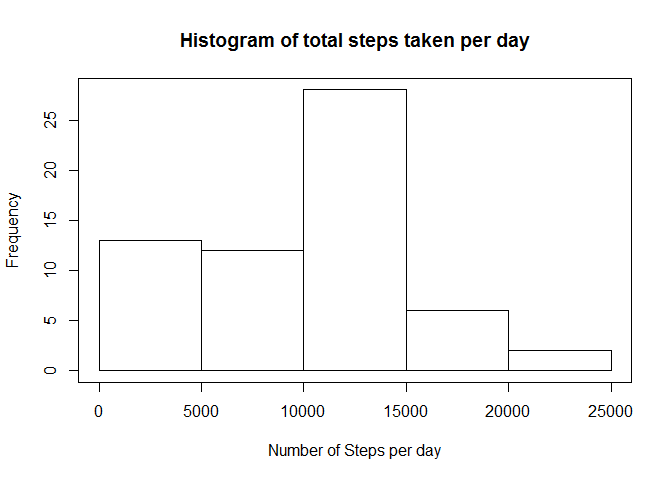
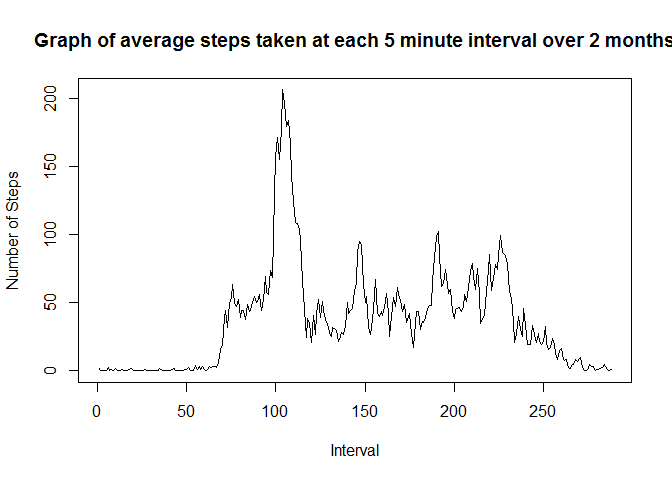
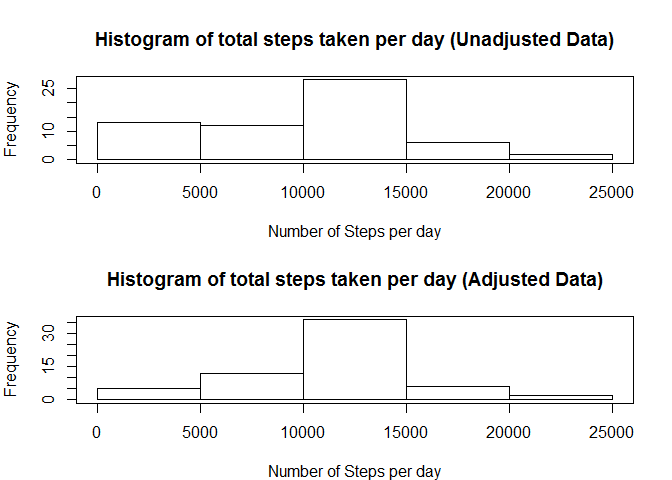
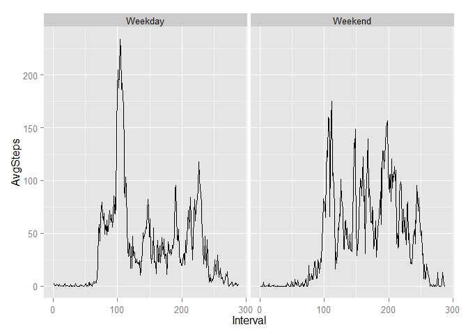

# Reproducible Research: Peer Assessment 1
David Chong

## Loading and preprocessing the data

```r
data <- read.csv("activity.csv", as.is=TRUE)
```
  

## What is mean total number of steps taken per day?

```r
Steps <- numeric()
CurDay <- ""
CurSteps <- 0
DayCount <- 0
for(i in 1:nrow(data)) {
  if(CurDay != data$date[i]) {
    #Add Steps if not day 0
    if(CurDay != "") {
      Steps <- c(Steps, CurSteps)
      CurSteps <- 0
    }
    DayCount <- DayCount + 1
    CurDay <- data$date[i]
  }
  if(!is.na(data$steps[i])) CurSteps <- CurSteps + data$steps[i]
  if(i == nrow(data)) Steps <- c(Steps, CurSteps)
}

MeanSteps <- mean(Steps)
MedianSteps <- median(Steps)

hist(Steps, xlab="Number of Steps per day", main="Histogram of total steps taken per day")
box()
```

 
  
The mean number of steps taken each day was 9354.23.  
The median number of steps taken each day was 1.0395\times 10^{4}

## What is the average daily activity pattern?

```r
Interval <- numeric()
IntervalSteps <- numeric()
IntervalCount <- numeric()

for(i in 1:nrow(data)) {
  if(!is.na(data$steps[i])) {
    Pos <- match(data$interval[i],Interval, nomatch=-1)
    if(Pos == -1) {
      Interval <- c(Interval, data$interval[i])
      IntervalCount <- c(IntervalCount, 1)
      IntervalSteps <- c(IntervalSteps, data$steps[i])
    }
    else {
      IntervalCount[Pos] <- IntervalCount[Pos] + 1
      IntervalSteps[Pos] <- IntervalSteps[Pos] + data$steps[i]
    }
  }
}

for(i in 1:length(Interval)) {
  IntervalSteps[i] <- IntervalSteps[i] / IntervalCount[i]
}

TimeLabels <- Interval[order(Interval)]
IntervalSteps <- IntervalSteps[order(Interval)]
Interval <- Interval[order(Interval)]
for(i in 1:length(Interval)) Interval[i] <- i

plot(Interval, IntervalSteps, type="l", main="Graph of average steps taken at each 5 minute interval over 2 months", ylab="Number of Steps")
```

 

```r
IntervalOrder <- order(IntervalSteps, decreasing = TRUE)

head(TimeLabels[IntervalOrder])
```

```
## [1] 835 840 850 845 830 820
```
The interval on average with the largest number of steps is 835.


## Imputing missing values

```r
MissingValues <- 0
for(i in 1:nrow(data)) {
  if(is.na(data$steps[i])) MissingValues <- MissingValues + 1
}
```
The number of rows with missing values is 2304.  
Replace missing values accordingly with average of each Interval.  

```r
AdjustedData <- data
for(i in 1:nrow(AdjustedData)) {
  if(is.na(AdjustedData$steps[i])) {
    Pos <- match(AdjustedData$interval[i], TimeLabels, nomatch=-1)
    if(Pos != -1) {
      AdjustedData$steps[i] <- IntervalSteps[Pos]
    }
  }
}

aSteps <- numeric()
aCurDay <- ""
aCurSteps <- 0
aDayCount <- 0
for(i in 1:nrow(AdjustedData)) {
  if(aCurDay != AdjustedData$date[i]) {
    #Add Steps if not day 0
    if(aCurDay != "") {
      aSteps <- c(aSteps, aCurSteps)
      aCurSteps <- 0
    }
    aDayCount <- aDayCount + 1
    aCurDay <- AdjustedData$date[i]
  }
  if(!is.na(AdjustedData$steps[i])) aCurSteps <- aCurSteps + AdjustedData$steps[i]
  if(i == nrow(AdjustedData)) aSteps <- c(aSteps, aCurSteps)
}

aMeanSteps <- mean(aSteps)
aMedianSteps <- median(aSteps)

par(mfrow=c(2,1), mar=c(4,4,4,2))
hist(Steps, xlab="Number of Steps per day", main="Histogram of total steps taken per day (Unadjusted Data)")
box()

hist(aSteps, xlab="Number of Steps per day", main="Histogram of total steps taken per day (Adjusted Data)")
box()
```

 
  
The mean number of steps taken each day changed from 9354.23 (Unadjusted) to 1.076619\times 10^{4} (Adjusted).  
The median number of steps taken each day changed from 1.0395\times 10^{4} (Unadjusted) to 1.076619\times 10^{4} (Adjusted).  

Overall there is a change in the mean and median after imputing missing values.  There is a rightward shift of values, resulting in an increase in both mean and median values.

## Are there differences in activity patterns between weekdays and weekends?

```r
data$date <- as.Date(data$date)
IsWeekend <- logical()
for(i in 1:nrow(data)) {
  if(weekdays(data$date[i]) == "Saturday" || weekdays(data$date[i]) == "Sunday") IsWeekend <- c(IsWeekend, T)
  else IsWeekend <- c(IsWeekend, F)
}
data <- cbind(data,IsWeekend)

library(dplyr)
WeekdayData <- filter(data, IsWeekend==F)
WeekendData <- filter(data, IsWeekend==T)

weInterval <- numeric()
weIntervalSteps <- numeric()
weIntervalCount <- numeric()

for(i in 1:nrow(WeekendData)) {
  if(!is.na(WeekendData$steps[i])) {
    Pos <- match(WeekendData$interval[i], weInterval, nomatch=-1)
    if(Pos == -1) {
      weInterval <- c(weInterval, WeekendData$interval[i])
      weIntervalCount <- c(weIntervalCount, 1)
      weIntervalSteps <- c(weIntervalSteps, WeekendData$steps[i])
    }
    else {
      weIntervalCount[Pos] <- weIntervalCount[Pos] + 1
      weIntervalSteps[Pos] <- weIntervalSteps[Pos] + WeekendData$steps[i]
    }
  }
}

for(i in 1:length(weInterval)) {
  weIntervalSteps[i] <- weIntervalSteps[i] / weIntervalCount[i]
}

weTimeLabels <- weInterval[order(weInterval)]
weIntervalSteps <- weIntervalSteps[order(weInterval)]
weInterval <- weInterval[order(weInterval)]
for(i in 1:length(weInterval)) weInterval[i] <- i

wdInterval <- numeric()
wdIntervalSteps <- numeric()
wdIntervalCount <- numeric()

for(i in 1:nrow(WeekdayData)) {
  if(!is.na(WeekdayData$steps[i])) {
    Pos <- match(WeekdayData$interval[i], wdInterval, nomatch=-1)
    if(Pos == -1) {
      wdInterval <- c(wdInterval, WeekdayData$interval[i])
      wdIntervalCount <- c(wdIntervalCount, 1)
      wdIntervalSteps <- c(wdIntervalSteps, WeekdayData$steps[i])
    }
    else {
      wdIntervalCount[Pos] <- wdIntervalCount[Pos] + 1
      wdIntervalSteps[Pos] <- wdIntervalSteps[Pos] + WeekdayData$steps[i]
    }
  }
}

for(i in 1:length(wdInterval)) {
  wdIntervalSteps[i] <- wdIntervalSteps[i] / wdIntervalCount[i]
}

wdTimeLabels <- wdInterval[order(wdInterval)]
wdIntervalSteps <- wdIntervalSteps[order(wdInterval)]
wdInterval <- wdInterval[order(wdInterval)]
for(i in 1:length(wdInterval)) wdInterval[i] <- i

library(ggplot2)
WeekdayDataFrame <- data.frame(wdTimeLabels, wdInterval, wdIntervalSteps, rep("Weekday",length(wdInterval)))
WeekendDataFrame <- data.frame(weTimeLabels, weInterval, weIntervalSteps, rep("Weekend",length(weInterval)))

names(WeekdayDataFrame) <- c("TimeInterval","Interval","AvgSteps","IsWeekend")
names(WeekendDataFrame) <- c("TimeInterval","Interval","AvgSteps","IsWeekend")

TotalDataFrame <- rbind(WeekdayDataFrame, WeekendDataFrame)

ggplot(TotalDataFrame, aes(Interval,AvgSteps))+geom_line()+facet_wrap(~IsWeekend)
```

 
